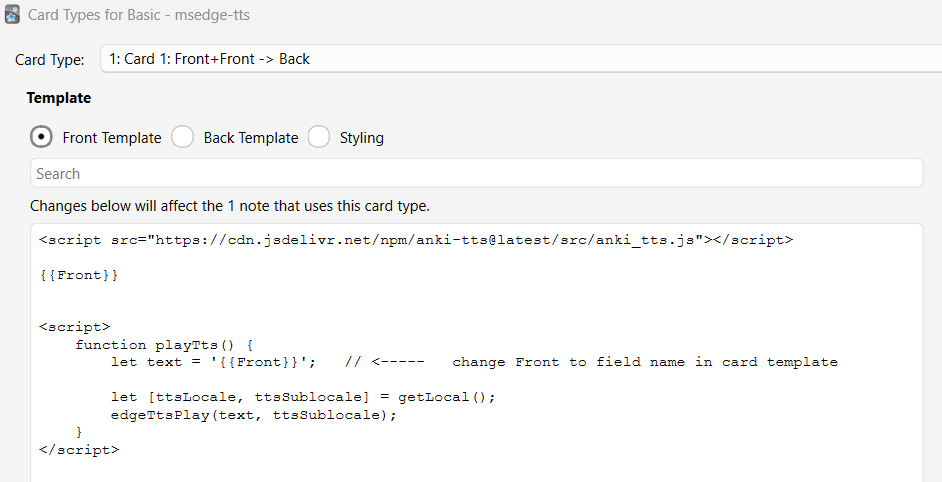
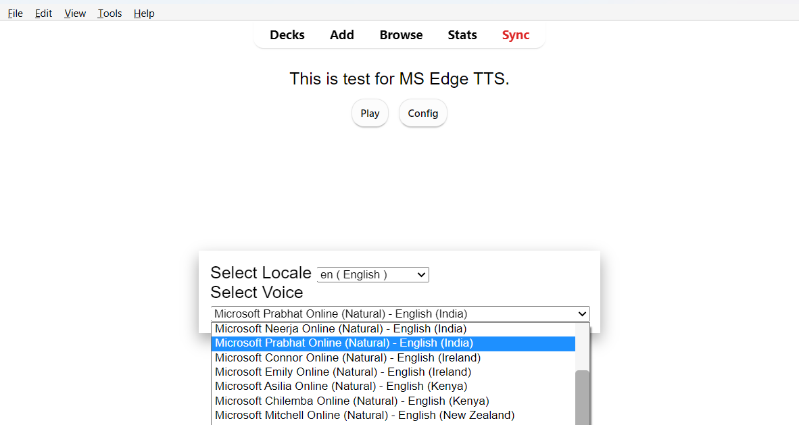

# Anki TTS

MS Edge TTS in Anki Card Template.

### Usage

Add following script tag at top in Anki Card Template using note editor.

```html
<script type="module" src="https://cdn.jsdelivr.net/gh/krmanik/anki-tts@latest/src/anki_tts.js"></script>
```

Then update the `playTts` method, change `{{Front}}` to field name. Lets say if field name in note type is Hanzi, then replace it with `{{Hanzi}}`. Copy following method to Card template.

```html
<script>
    function playTts() {
        let text = '{{Front}}';   // <-----   change Front to field name in card template

        let [ttsLocale, ttsSublocale] = getLocal();
        edgeTtsPlay(text, ttsSublocale);
    }
</script>
```

Click on config button during review to set language and set config.

Then click play to text to speech





## Credits

- [Migushthe2nd/MsEdgeTTS: A simple Azure Speech Service module that uses the Microsoft Edge Read Aloud API](https://github.com/Migushthe2nd/MsEdgeTTS)
- [JS port of https://github.com/Migushthe2nd/MsEdgeTTS](https://gist.github.com/likev/c36fcc8a08ba1a2c5d08f9c7d806a0ad)
